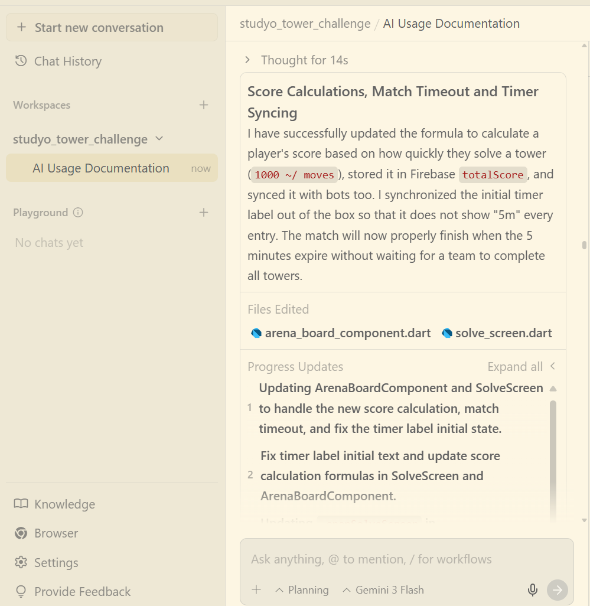
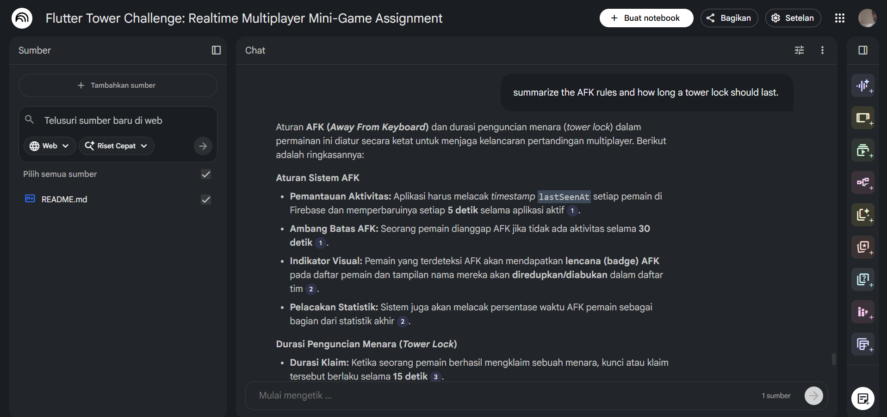

# AI Usage Documentation

This document outlines the AI tools and methodologies used during the development of the **Realtime Team Mini-Game (Tower Challenge)** in accordance with the mandatory assignment requirements.

## 🛠️ AI Tools Used

1. **AntiGravity (Primary coding assistant)**
2. **NotebookLM (Documentation and Reading Assistant)**

---

## 🚀 How AI Was Utilized

### 1. AntiGravity (Code Generation, Architecture, and Debugging)
AntiGravity was used as the primary pair-programming assistant throughout the development lifecycle.

*   **Architecture Implementation:** I used AntiGravity to refactor the initial codebase into a strict **Clean Architecture** structure. It assisted in separating the Presentation (GetX controllers, UI), Domain (UseCases, Entities, Repository interfaces), and Data layers (Firebase DataSources, Models).
*   **Flame Engine Integration:** AntiGravity provided guidance on how to properly embed `FlameGame` inside the Flutter widget tree and how to use Flame components (`PositionComponent`, `TapCallbacks`) for the towers and game arena interactions.
*   **Firebase Realtime Database & Concurrency:** I consulted AntiGravity to implement transactional operations (`claimTower`, `solveTower`) to ensure race conditions were handled correctly when multiple users tapped the same tower. 
*   **Debugging & Bug Fixes:** When team scores were initially calculating incorrectly (e.g., sticking at 0), AntiGravity helped trace the bug down to how the scores were synced from the bot animations vs. the Firebase Realtime updates, leading to a much more accurate real-time scoreboard synchronization.

### 2. NotebookLM (Rapid Documentation Parsing)
I utilized NotebookLM to accelerate my understanding of technical documentation and assignment requirements.

*   **Project Requirements Analysis:** I uploaded the raw assignment instructions into NotebookLM to quickly query the specific edge-cases (e.g., "What happens if a user goes AFK while claiming a tower?").
*   **Flame Engine Documentation:** I used it to quickly digest Flame and Flame-Lottie documentation to understand how to correctly implement the game loop and particle animations.

---

## ✨ Key Improvements Suggested by AI

1. **Client-Side Score Calculation:** Instead of forcing Firebase to manually calculate and store scores redundantly, AntiGravity suggested structuring the `ArenaPlayerModel` to parse `towersSolved` and `averageMoves` and compute the total `score` client-side using `(200 / averageMoves) * towersSolved`. This significantly reduced backend complexity and write operations.
2. **Synchronized Bot Behavior:** Initially, simulating bot solves was decoupled from the UI, causing mismatching scores. The AI suggested linking the bot's visual typing animation completion *directly* to its Firebase stats update, making the bots feel perfectly synchronized and organic.
3. **Optimized Firebase Rules:** The AI provided specific `.indexOn` rules for `liveMatches` to prevent unindexed search warnings when querying players by `team` or `lastSeenAt` for the AFK detection system.

---

## 📸 Evidence of AI-Assisted Development

*(Note: Replace the placeholders below with your actual screenshots of your chats with the AI)*

 

### Example 1: Synchronizing Bot Scores with UI
> **Prompt Intent:** Fixing the bug where simulated bots were sitting at 0 points by ensuring UI completion triggers Firebase updates.
> 

### Example 2: NotebookLM Querying
> **Prompt Intent:** Asking NotebookLM to summarize the AFK rules and how long a tower lock should last.
> 

