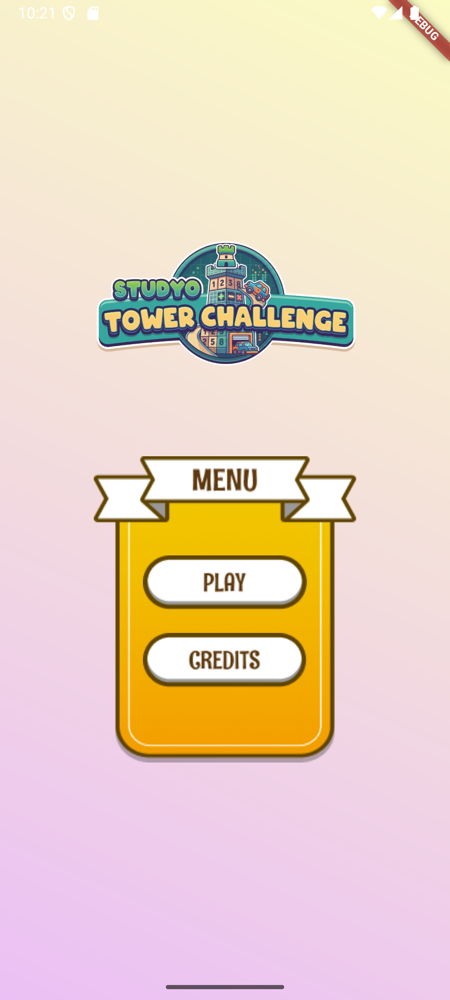
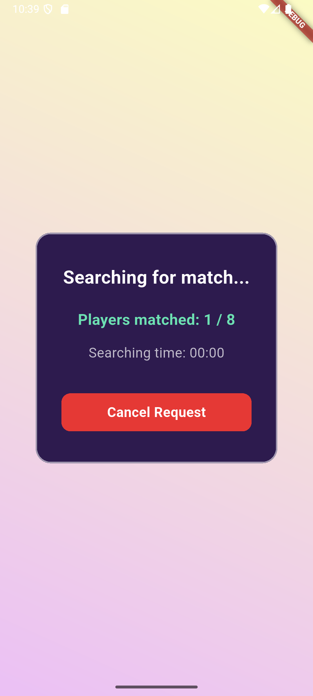
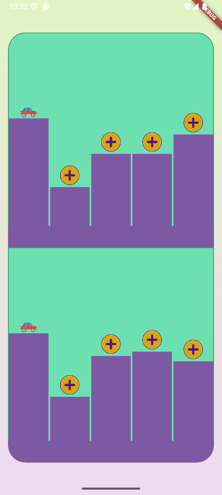
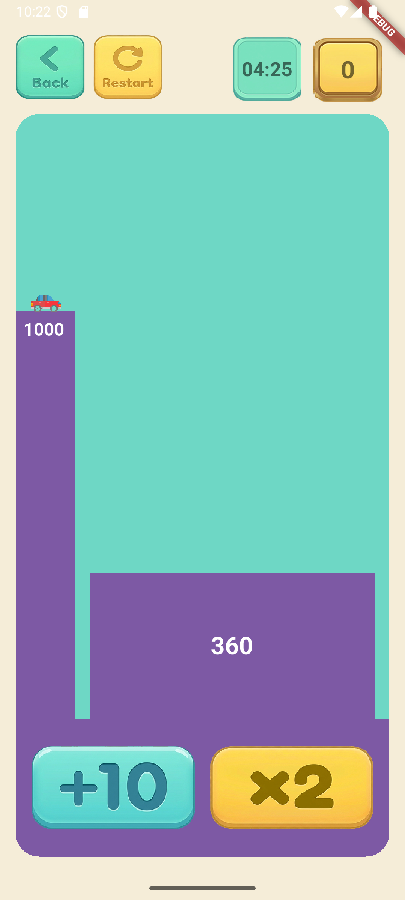
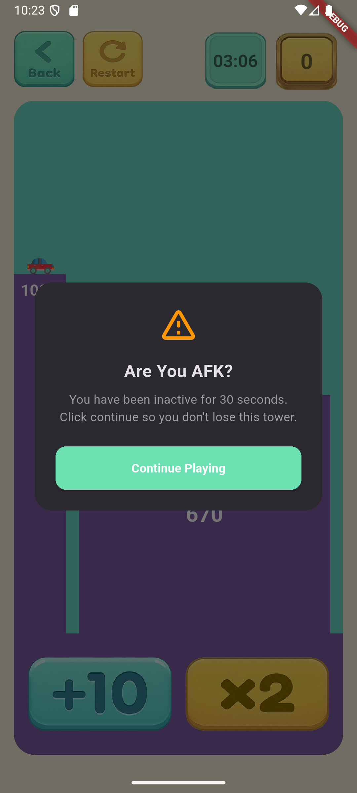
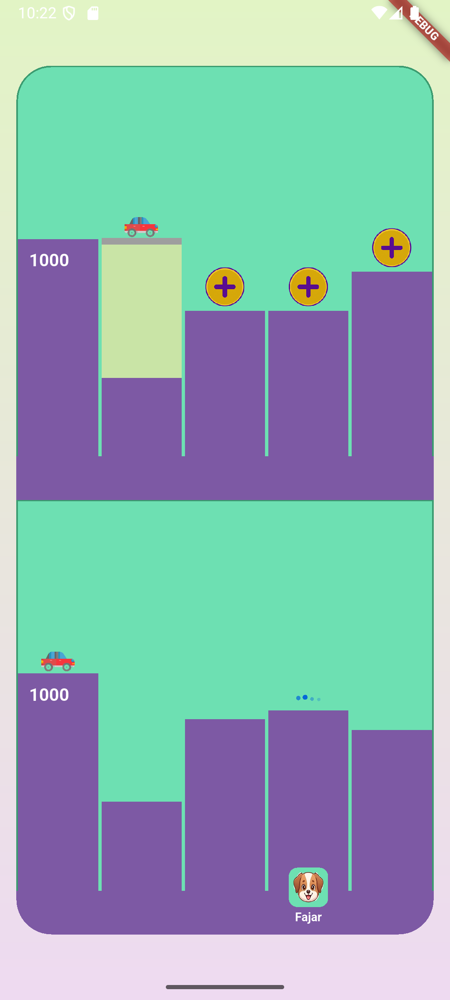
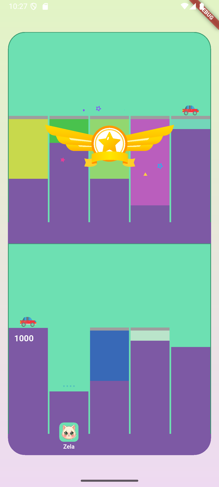
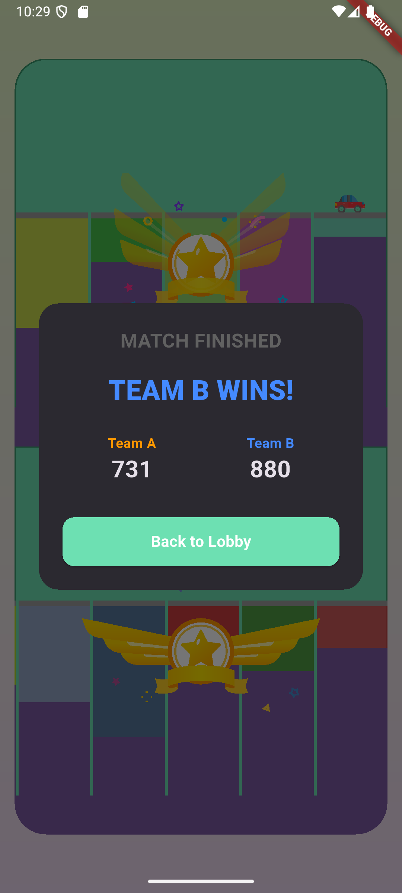

# Tower Challenge — Real-time Team Mini-Game

 <!-- Note: Replace with actual banner if available -->

A high-performance, real-time competitive multiplayer game built with **Flutter**, **Flame Engine**, and **Firebase Realtime Database**. Players are divided into two teams (Team A and Team B) and must race to solve towers by reaching a target numeric value using specific operations (+10, ×2).

## 🚀 Key Features

-   **Real-time Multiplayer:** Powered by Firebase RTDB with atomic transactions for tower claiming and solving.
-   **Flame Engine Rendering:** High-performance game arena with smooth animations, scrolling towers, and visual effects.
-   **Smart Bot Simulation:** Autonomous bots that solve towers visually on the board, perfectly synchronized with their scores.
-   **AFK Detection:** Real-time monitoring of player activity; towers are automatically released if a player becomes inactive.
-   **Clean Architecture:** Scaleable and testable code structure following Domain-Driven Design (DDD) principles.
-   **Responsive UI:** Beautiful, modern interface with dynamic height animations and success effects.

## 🏗️ Architecture

The project follows the **Clean Architecture** pattern to ensure a clear separation of concerns:

-   **Domain Layer:** Contains Business Logic, Entities, and Use Case definitions.
-   **Data Layer:** Handles external data sources (Firebase), repository implementations, and data models.
-   **Presentation Layer:** Managed by **GetX** for reactive state management, splitting complex logic into Controllers and modular Widgets.

## 🖼️ Gallery

### Lobby & Matchmaking
| Join/Create Lobby | Searching for Players |
|---|---|
|  |  |

### Gameplay & Arena
| Game Arena | Solving Tower |
|---|---|
|  |  |

### Features & Win Condition
| AFK Detection | Done Solved tower |
|---|---|
|  |  |

| Success Solved All | Match Finished |
|---|---|
|  |  |


## 🛠️ Tech Stack

-   **Framework:** [Flutter](https://flutter.dev/)
-   **Game Engine:** [Flame](https://flame-engine.org/)
-   **State Management:** [GetX](https://pub.dev/packages/get)
-   **Database:** [Firebase Realtime Database](https://firebase.google.com/docs/database)
-   **Animations:** [Lottie](https://pub.dev/packages/lottie)

## 📦 Getting Started

### Prerequisites

-   Flutter SDK (3.x or latest)
-   Firebase Account

### Installation

1.  **Clone the repository:**
    ```bash
    git clone [repository-url]
    cd studyo_tower_challenge
    ```

2.  **Install dependencies:**
    ```bash
    flutter pub get
    ```

3.  **Firebase Setup:**
    -   Create a new project in the [Firebase Console](https://console.firebase.google.com/).
    -   Enable **Realtime Database**.
    -   Apply the security rules found in project documentation or use public rules for testing:
        ```json
        {
          "rules": {
            ".read": "true",
            ".write": "true"
          }
        }
        ```
    -   Add your `google-services.json` (Android) and `GoogleService-Info.plist` (iOS) to the respective platform folders.

4.  **Run the application:**
    ```bash
    flutter run
    ```

## 🎮 How to Play

1.  **Join a Lobby:** Create or join a match lobby.
2.  **Select a Team:** Choose Team A or Team B.
3.  **Claim a Tower:** Tap any available (green) tower to start solving.
4.  **Solve the Puzzle:** Use the `+10` and `×2` buttons to reach the **Target Value** (e.g., 1000).
5.  **Win the Match:** The team with the highest score when the timer hits zero wins!

---

Developed with ❤️ using **Clean Architecture** and **AI-Assisted Development** (AntiGravity & NotebookLM).
